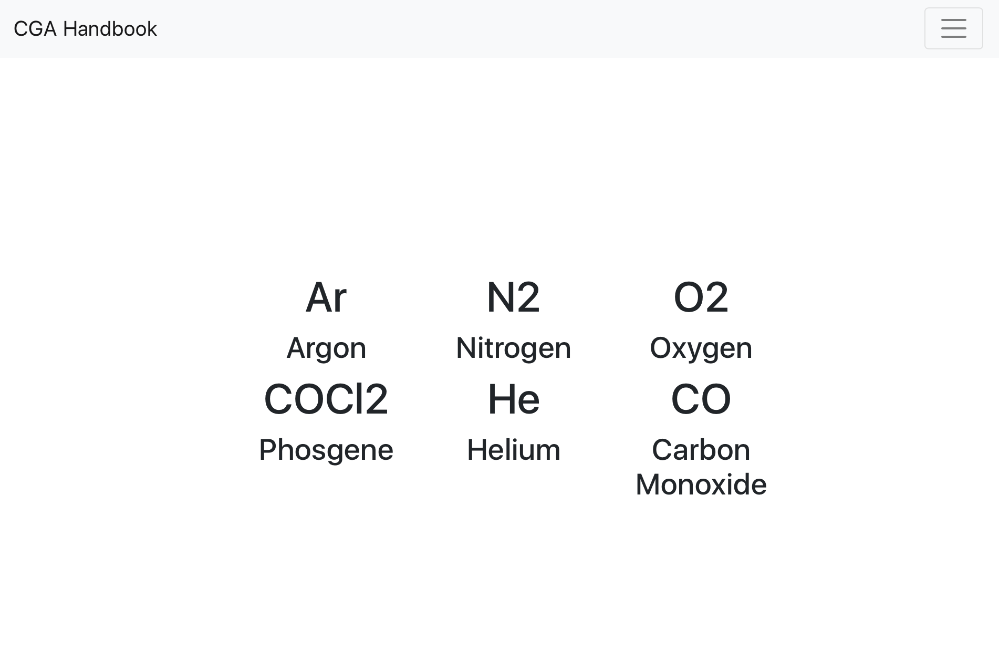

# NuxtHandbook

A very simple web app built with Vue and Nuxt to show the properties of certain chemicals. This is a demo and feasibility test of using Vue and Nuxt to build this into a production site for a client.

### Build

```bash
# Install dependencies, build, and start server
$ npm install
$ npm run build
$ npm run start
```

### Screenshot


